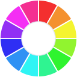

   

<h1 align="center">
Color Picker by Codigrate
</h1>

A fast, simple eyedropper for your browser. Pick any color on your screen and copy it as HEX, RGB or HSL, right from your toolbar.

   
   
   

## Getting Started

1. Open the [Chrome Web Store page](https://chromewebstore.google.com/detail/kemglmedckibbmnfmeppkgconcpckepm).
2. Click **Add to Chrome**.
3. Pin the Color Picker icon to your toolbar.
4. Click the icon, press **Pick a Color**, and click any pixel on your screen.

## Features

- **Eyedrop anywhere.** Sample any pixel on your screen: a web page, an image, a video, a design tool, anything you can see.
- **HEX, RGB and HSL.** Every color in all three formats, with one click to copy the one you need.
- **Recent colors.** Your last picks stay in the popup, so the shades you are working with are always one click away.
- **Open in Codigrate.** Send any color straight to the [Codigrate color tool](https://codigrate.com/tools/color) for shades, harmony and contrast.
- **Matches your theme.** With the [All In One Themes](https://chromewebstore.google.com/detail/iekicoldppmopekekolhdoofncnhhbeh) extension installed, the picker tints itself to your active Codigrate browser theme.

## Privacy

- The only permission is `storage`, used to keep your recent colors locally.
- No sign in, no clutter, no tracking. Your colors never leave your device.
- The eyedropper uses the browser's built-in `EyeDropper` API (Chrome 95+) and needs no extra permission.

## Develop / load locally

1. Open `chrome://extensions`.
2. Enable **Developer mode**.
3. Click **Load unpacked** and select this folder.

## Structure

| File | Purpose |
|---|---|
| `manifest.json` | MV3 manifest (action popup, `storage`) |
| `popup.html` / `popup.css` / `popup.js` | the popup UI and logic |
| `images/` | toolbar / store icons and the footer logo |

---

Part of the Codigrate tools family, alongside the in-browser
<a href="https://codigrate.com/tools/color">color</a>,
<a href="https://codigrate.com/tools/palette">palette</a> and
<a href="https://codigrate.com/tools/gradient">gradient</a> tools.

