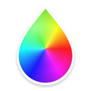

   

<h1 align="center">
Color Picker by Codigrate
</h1>

An eyedropper for your browser with the full Codigrate color toolkit behind it. Pick any color on your screen and read it in every color space, check its contrast and explore its harmonies, right from your toolbar.

   
   
   

## Getting Started

1. Open the [Chrome Web Store page](https://chromewebstore.google.com/detail/kemglmedckibbmnfmeppkgconcpckepm).
2. Click **Add to Chrome**.
3. Pin the Color Picker icon to your toolbar.
4. Click the icon, press **Pick a Color**, and click any pixel on your screen.

## Features

- **Eyedrop anywhere.** Sample any pixel on your screen: a web page, an image, a video, a design tool, anything you can see.
- **Copy-ready CSS.** Color, background, border, text shadow and box shadow rules, one click to copy.
- **Accessibility.** WCAG 2 contrast ratio and APCA (WCAG 3) of the color as text on white, black and its complement, both directions, with AA / AAA verdicts.
- **Color channels.** RGB, HSL, HSV and CMYK channel bars.
- **Every color space.** Hex, RGB, RGB %, web-safe, decimal, octal, binary, HSL, HSV, HWB, OKLCH, OKLab, CIE-LAB, CIE-LCH, CMYK, the nearest RAL Classic code, XYZ, Yxy and Hunter Lab, each one click to copy.
- **Harmony.** Analogous, monochrome, complementary, split complementary, triadic and tetradic chips built on the color wheel; click a chip to load it.
- **Tints, shades and tones, warmer and cooler.** Ten-step ramps toward white, black and gray, and along the warm to cool axis.
- **Color vision deficiency.** How the color reads under protan, deutan, tritan and monochromacy, both the -omaly and the -opia forms.
- **Recent colors.** Your last twelve picks stay in the popup, so the shades you are working with are always one click away.
- **Open in Codigrate.** Send any color straight to the [Codigrate color tool](https://codigrate.com/tools/color) for shades, harmony and contrast.
- **Matches your theme.** With the [All In One Themes](https://chromewebstore.google.com/detail/iekicoldppmopekekolhdoofncnhhbeh) extension installed, the picker tints itself to your active Codigrate browser theme.

## Privacy

- The only permission is `storage`, used to keep your recent colors locally.
- No sign in, no clutter, no tracking. Your colors never leave your device.
- The eyedropper uses the browser's built-in `EyeDropper` API (Chrome 95+) and needs no extra permission.

## Develop / load locally

1. Open `chrome://extensions`.
2. Enable **Developer mode**.
3. Click **Load unpacked** and select this folder.

## Structure

| File | Purpose |
|---|---|
| `manifest.json` | MV3 manifest (action popup, `storage`) |
| `popup.html` / `popup.css` / `popup.js` | the popup UI and logic (the same sections as the Codigrate Color Picker for JetBrains, with the same math) |
| `ral-classic.js` | the 216 RAL Classic colors used for the nearest-RAL match |
| `images/` | toolbar / store icons and the footer logo |
| `make-icons.swift` | renders the icon set from the same spectrum drop as the Mac App Store app |
| `make-icon-svg.py` | vector build of the same drop, for codigrate.com |

---

Part of the Codigrate tools family, alongside the in-browser
<a href="https://codigrate.com/tools/color">color</a>,
<a href="https://codigrate.com/tools/palette">palette</a> and
<a href="https://codigrate.com/tools/gradient">gradient</a> tools.

<!-- codigrate-readme-footer -->

## Contributing

Issues and suggestions are welcome. Open an issue on this repository, or reach us at [info@codigrate.com](mailto:info@codigrate.com).

## Contributors

## License

The source code for this project is released under the [MIT License](LICENSE).

## Codigrate

Themes, color tools and developer experience products from [Codigrate](https://codigrate.com).

   <a href="https://codigrate.com/themes">All Themes</a> ·
   <a href="https://codigrate.com/tools">Color Tools</a> ·
   <a href="https://codigrate.com/plugins">Plugins</a> ·
   <a href="https://codigrate.com/blog">Blog</a> ·
   <a href="https://github.com/codigrate">GitHub</a>

<table align="right"><tr><td></td><td><b>Codigrate © 2026</b></td></tr></table>
